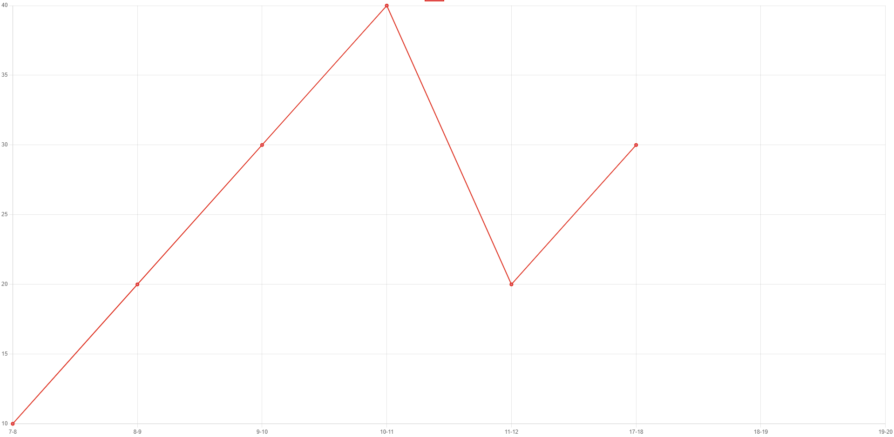

# 11팀 유헌상

---

# 23.01.16

## Redux Toolkit

### state가 array, object인 경우 변경방법

- array / object의 경우 직접 수정해도 state는 변경된다.
  
  - state가 array / object 면 return 없이 직접 수정해도 된다.

- state 변경함수에 파라미터 작성 -> 파라미터를 이용하여 비슷한 함수를 여러개 작성하지 않아도 된다.
  
  - action => state 변경함수
  
  ```
  
  ```

- state 수정
  
  - 수정함수를 만들고
  
  - export하고
  
  - import 해서 사용

- state._findIndex_(()=>{ })
  
  - array에서 원하는 요소가 몇번째에 있나 찾아주는 함수

- state._push_()
  
  - array 뒤에 자료 추가해주는 함수

## Figma

### Auto Layout

- 내부 컨텐츠에 따라 자동으로 변형되는 프레임

- 버튼이나 카드컴포넌트들의 내부 내용이 수정되어도 프레임의 사이즈를 자동으로 수정

- shift + A
1. 오토레이아웃 구성요소
   
   1. 컨테이너
   
   2. 아이템

2. 한 프레임에 하나의 방향 -> 한 컨테이너에 한가지 방향밖에 안되므로 줄바꿈이 되지 않는다

3. Resizing
   
   - 요소의 크기가 변경되었을 때, 이와 관련된 요소들의 크기도 같이 변경
   
   - Hug Contents : 아이템 변화 -> 컨테이너도 변화 (컨테이너에 설정)
   
   - Fill Container : 컨테이너 변화 -> 아이템도 변화 (아이템에 설정)
   
   - Fixed Size : 변화 없음

---

---

# 23.01.17

## Local Storage

- 브라우저에서 제공하는 데이터 저장소

- Key : Value 형태로 저장 가능

- 최대 5MB 문자만 저장가능

- 브라우저 청소 전까지 사이트를 재접속해도 남아있음

- Session Storage의 경우 브라우저를 끄면 데이터가 날아감

데이터입력```localStorage.setItem('이름', '값')```

데이터출력 `localStorage.getItem('이름')`

데이터삭제 `localStorage.removeItem('이름')`

데이터수정하는 문법은 따로 없고 데이터를 꺼내서 수정하고 다시 집어 넣는다

array, object를 저장하려면 JSON으로 바꾸어 저장한다

array, object -> JSON 변환은 JSON.stringify()

```
  let obj = {name : 'kim' }
  localStorage.setItem('data', JSON.stringify(obj))
```

## Chart.js 사용

```
import React from 'react';
import Chart from 'chart.js/auto';
import { Line } from 'react-chartjs-2';

function app() {

  let data =  {
      labels: ['7-8', '8-9', '9-10', '10-11', '11-12', '17-18', '18-19', '19-20' ],
      datasets: [
        {
          type: 'line',
          label: '탑승인원',
          backgroundColor: 'rgb(255, 99, 132)',
          data: [10, 20, 30, 40, 50, 20, 30, 10, 100],
          borderColor: 'red',
          borderWidth: 2,
        },
      ],
    };

    return (
        <div>
            <Line type="line" data={data} />
        </div>
    );

}

export default app;  
```

`import Chart from 'chart.js/auto'`는 import하여 따로 사용하는 부분이 있는 것은 아니지만 없으면 오류가 나기 때문에 import해주어야 한다.

type : bar, line 등등 그래프의 형태를 정해준다.

data부분에서  상단의 labels의 개수보다 많은 데이터가 들어가게 되면, 그래프의 형태는 labels의 개수만큼 출력되고 그 외는 y축의 변화만 나타내어 졌다.

labels의 개수보다 data의 수가 적으면 x축이 고정된 상태로 그래프가 출력된다.



---

# 23.01.18

## Zustand는 무엇인가?

- 특정 라이브러리에 엮이지 않는다

- 한 개의 중앙에 집중된 형식의 스토어 구조를 활용하면서, 상태를 정의하고 사용하는 방법이 단순하다

- Context API를 사용할 때와 달리 상태 변경 시 불필요한 리랜더링을 일으키지 않도록 제어하기 쉽다

- React에 직접적으로 의존하지 않기 때문에 자주 바뀌는 상태를 직접 제어할 수 있는 방법도 제공한다

- 동작을 이해하기 위해 알아야 하는 코드 양이 아주 적다

설치

`npm i zustand`

### 간략한 Zustand 사용 방법

- 스토어를 만들 때는 create 함수를 이용하여 상태와 그 상태를 변경하는 액션을 정의한다. 그러면 리액트 컴포넌트에서 사용할 수 있는 useStore 훅을 리턴한다.

```js
import create from 'zustand';

// set 함수를 통해서만 상태를 변경할 수 있다
const useStore = create(set => ({
  bears: 0,
  increasePopulation: () => set(state => ({ bears: state.bears + 1 })),
  removeAllBears: () => set({ bears: 0 })
}));
```

- store 생성

```js
// store.js

import create from 'zustand' // create로 zustand를 불러옵니다.

const useStore = create(set => ({
  bears: 0,
  increasePopulation: () => set(state => ({ bears: state.bears + 1 })),
  removeAllBears: () => set({ bears: 0 })
}))

export default useStore
```

`bears`라는 초기값을 선언. 그 값을 조작 하는 `increasePopulation(bears를 1씩 증가)` 과 `removeAllBears(bears를 0으로 리셋)`를 선언합니다. 이때 `set`을 활용

- store에 생성한 useStore를 불러와서 사용하기

```js
import useStore from '../store.js'

const App = () => {
    const { bears, increasePopulation, removeAllbears } = useStore(state => state)

    return (
    <>
        <h1> {bears} around here ... </h1>
        <button onClick={increasePopulation}> one up <button>
        <button onClick={removeAllBears}> remove all </button>
    </>
    )
}
```

store에 선언한 값과 메서드를 useStore를 통해 불러와서 간단하게 사용.

---

# 23.01.19
